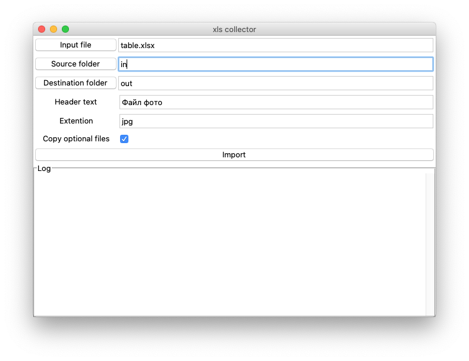

# File_collector

Утилита предназанчена для копирования файлов по списку из одной папки в другую

### Входные параметры

|      Название       |                               Описание                                |
| :-----------------: | :-------------------------------------------------------------------: |
|     input file      |        Входной файл xls в котором будет искаться список файлов        |
|    Source folder    |                 Главная директория для поиска файлов                  |
| Destiantion folder  |                   Директория для копирования файлов                   |
|     Header text     |           Тест заголовка столбца таблицы со списком файлов            |
|      Extention      |     Расширение файлов (подставляется к названию файла при поиске)     |
| Copy optional files | Опиця копирования невыбранных файлов в выходную подкатегорию /options |

## Описание работы

1.  Утилита ищет во входной таблице xls ячейку, которая содежит искомый текст
2.  Предполагается, что под найденой ячейкой находится спискок из названий файлов. Причем в одной
    ячеке можен нажодится несколько названий. разделенных или запятыми, или пробелами например:

        |   ..  |  текст заголовка  |   ..  |
        |   ..  |  foto1, foto_2    |   ..  |
        |   ..  |  another_foto3    |   ..  |
        |   ..  |                   |   ..  |
        |   ..  |  morefoto4 more5  |   ..  |

    Будет сформирован список:

        foto1
        foto_2
        another_foto3
        morefoto4
        more5

3.  Названия файлов из сформированного списка с заданным расширением ищутся в каталоге _source folder_ и во
    всех его подкаталогах, подкаталогах подкаталогов и т. д.
4.  При этом если в указанных каталогах находится несколько файлов с одинаковыми названиями, то для последующего
    копирования выбиратеся файл с наибольшим количеством повторений (анализируется размер и содержимое файлов).
5.  Если выбрана опция _Copy optional files_, то из оставшихся фалйов убираются все дубликаты по содержимому и
    оставшиеся уникальные файлы копируются в подппапку _options_. При этом к каждому названию уникальномого файла добавляется цифровой индекс.

    Например, если файл с низванием photo был найден в каталогах 7 раз, при этом по содержимому эти фалы различались:

        | catalogue     |   name    |   Type    |

        | src/          |   photo   |   type 1  |   ->  будет скопирован в выходную папку
        | src/s/        |   photo   |   type 2  |   ->  будет скопирован в выходную папку/options
        | src/s/w/      |   photo   |   type 1  |       пропущен
        | src/p/        |   photo   |   type 3  |   ->  будет скопирован в выходную папку/options
        | src/p/2       |   photo   |   type 3  |       пропущен

## Версии

- [для Windows](dist/Collector.exe)
